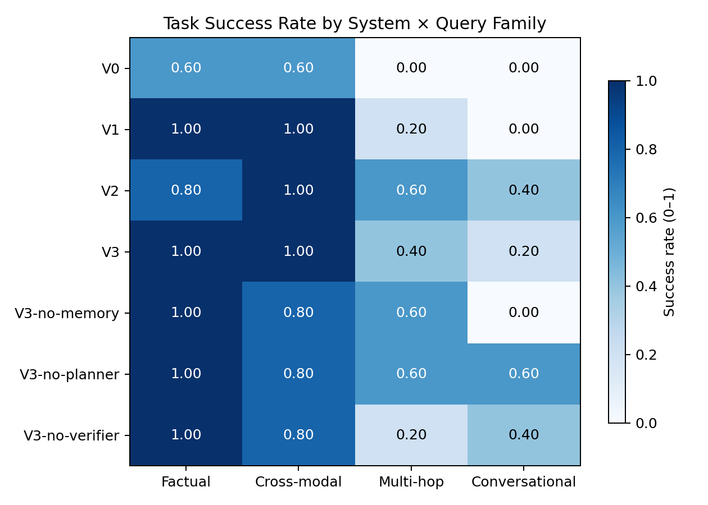
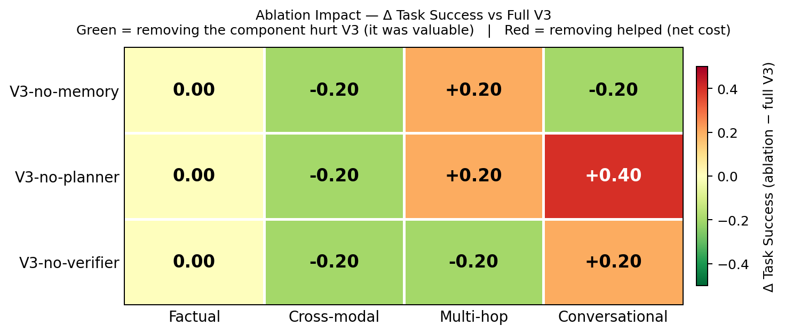
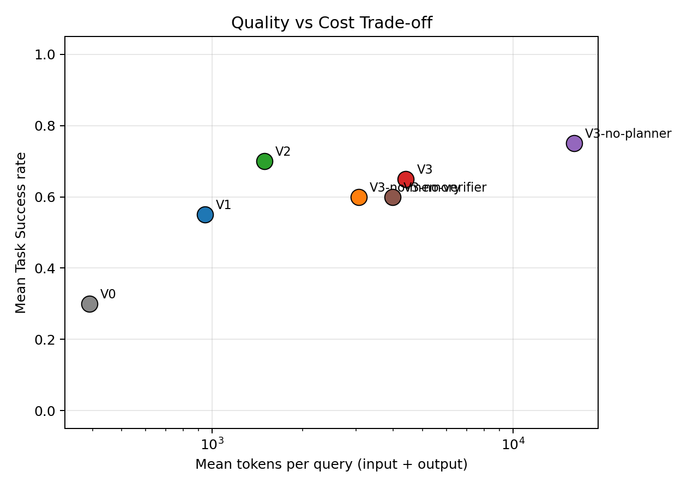
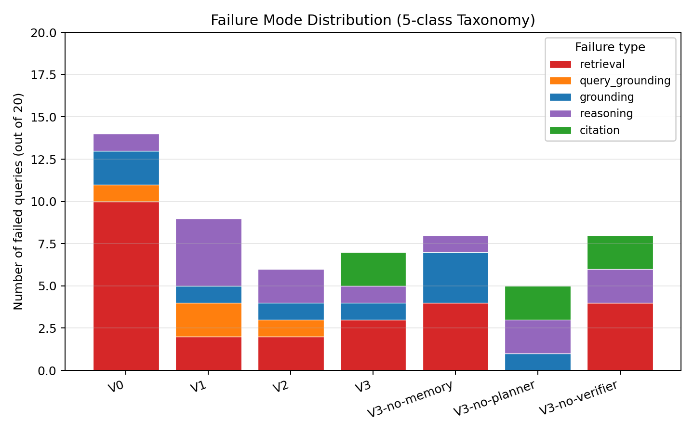

# Multimodal Recipe Agent — From RAG to Agent, and What It Costs

A controlled comparison of **4 architectures** for personalised recipe QA — plain LLM → text RAG → multimodal RAG → LangGraph agent — plus **3 ablations** of the agent, evaluated on a fixed query set with per-record metrics and a failure taxonomy.

**7 systems × 20 queries = 140 records**, scored on task success, retrieval recall@3, faithfulness, visual grounding, latency, tool calls and token cost.

The short version: **the agent is not uniformly better.** It wins on faithfulness and cross-modal grounding, loses to plain multimodal RAG on overall task success, collapses on multi-hop retrieval, and costs ~5× more latency and ~2× more input tokens. The ablations are stranger still — see below.

---

## Results

### Architecture comparison

Means across all 4 query families (factual, multi-hop, cross-modal, conversational):

| System | Task success | recall@3 | Faithfulness | Latency | Input tokens |
|---|---|---|---|---|---|
| **V0** plain LLM | 0.30 | 0.00 | 0.00 | 4.5 s | 74 |
| **V1** text RAG | 0.55 | 0.89 | 0.98 | 3.9 s | 653 |
| **V2** multimodal RAG | **0.70** | 0.88 | 0.98 | 5.9 s | 1,038 |
| **V3** LangGraph agent | 0.65 | 0.70 | **1.00** | 27.2 s | 2,063 |



**Retrieval is the single biggest win.** V0 → V1 adds +0.25 task success and takes faithfulness from 0.00 to 0.98 — grounding the model in retrieved recipes eliminates fabrication almost entirely. Nothing later in the stack comes close to that jump.

**Multimodal retrieval pays for itself.** V1 → V2 adds +0.15, concentrated in multi-hop (0.2 → 0.6) and conversational (0.0 → 0.4). Image-side retrieval helps even on questions that aren't explicitly visual.

**The agent does not beat plain multimodal RAG on task success** (0.65 vs 0.70) while costing 4.6× the latency and 2× the input tokens. It does win where correctness is strict: faithfulness is a perfect 1.00 across every family, and cross-modal visual grounding is the highest of any system (0.93).

### The multi-hop collapse

The agent's worst result, and the most interesting one:

| System | multi-hop recall@3 |
|---|---|
| V1 text RAG | 0.675 |
| V2 multimodal RAG | 0.625 |
| **V3 agent** | **0.100** |

The planner decomposes multi-hop questions into sub-queries and retrieves against each one independently. When the decomposition is wrong, every downstream retrieval is wrong — and unlike single-shot RAG, there is no path back. Single-shot retrieval over the raw question is *more robust* here precisely because it doesn't commit to a plan.

### Ablations: removing the planner makes it better

| Variant | Task success | recall@3 | Latency | Input tokens | Tool calls |
|---|---|---|---|---|---|
| V3 full | 0.65 | 0.70 | 27.2 s | 2,063 | 3.6 |
| V3 − memory | 0.60 | 0.72 | 17.9 s | 1,649 | 2.8 |
| **V3 − planner** | **0.75** | **0.84** | 33.6 s | **13,741** | **9.6** |
| V3 − verifier | 0.60 | 0.62 | 19.5 s | 2,040 | 3.0 |



**Dropping the planner produces the best task success of any system tested (0.75)** — but it gets there by brute force. Without a plan the executor falls back to reactive tool calling: 9.6 tool calls per query against the full agent's 3.6, and **13,741 input tokens against 2,063 — 6.7×**. On conversational queries it degenerates to 20.2 tool calls and 24k input tokens.

So the planner isn't useless; it's a **cost control** that trades a little accuracy for a 6.7× token reduction. That trade-off was invisible until the ablation was run.

**The verifier earns its place**: removing it drops multi-hop recall@3 to 0.05, the worst number in the study.

**Memory is roughly cost-neutral** on this query set, which is expected — only the conversational family exercises it, and at n=5 that signal is thin.

### Cost vs quality



If latency and token spend matter, **V2 is the efficient frontier**: 0.70 task success at 5.9 s and ~1k input tokens. Every agent variant pays 3–6× more for equal or worse task success. The agent is the right choice only when faithfulness must be absolute or the query is genuinely cross-modal.

### Failure taxonomy

57 failed records, hand-classified into 5 types:



| Failure type | Count | Share |
|---|---|---|
| retrieval | 25 | 44% |
| reasoning | 13 | 23% |
| grounding | 9 | 16% |
| citation | 6 | 11% |
| query_grounding | 4 | 7% |

**Retrieval is the bottleneck, not reasoning.** 44% of all failures are the system fetching the wrong recipe — the LLM then reasons correctly over wrong evidence. This is the clearest direction for further work: better retrieval would move more than a bigger model or a deeper agent graph.

### Limitations

20 queries, n=5 per family, single run per record, rule-based scoring. Enough to separate architectures that differ by large margins; **not** enough to resolve the smaller gaps (V2 vs V3 at 0.70 vs 0.65 is within noise at this sample size). Treat the ordering as directional and the mechanisms as the real finding.

---

## Architecture

**V0** — plain LLM, no retrieval.
**V1** — text RAG over recipe documents (ChromaDB).
**V2** — V1 plus image-side retrieval for visual queries.
**V3** — LangGraph agent, 6 nodes:

```
memory_load → planner → executor → verifier → generator → memory_update
```

Five tools available to the executor: `search_text_content`, `search_image_visual`, `filter_recipes`, `compute_aggregate`, `get_recipe_by_id`. Two executor strategies are implemented — plan-and-execute (default) and a reactive fallback used by the `−planner` ablation — with cross-step reference resolution so later steps can consume earlier results.

Query families: **factual** (single lookup), **multi-hop** (chained retrieval), **cross-modal** (text question over image evidence), **conversational** (multi-turn, requires memory).

---

## Install

Activate your conda env first, then:

```
pip install -r src/requirements.txt
```

All commands below assume the `recipe_agent` conda env is active — use
`python`, not the Windows `py` launcher (`py` bypasses conda and goes to
the system Python, splitting packages across two interpreters).

Then set the DeepSeek API key. Pick one:

```powershell
# A. Current PowerShell session only (takes effect immediately)
$env:DEEPSEEK_API_KEY = "<your-key>"

# B. Persistent across new shells (reopen PowerShell to pick it up)
setx DEEPSEEK_API_KEY "<your-key>"
```

Verify with `echo $env:DEEPSEEK_API_KEY` — should print your key.

## Run

```
python src/benchmark.py                          # full run: 7 systems × 20 queries = 140 records
python src/benchmark.py --systems V0,V3          # restrict systems
python src/benchmark.py --queries QF1.1,QF3.5    # restrict queries
python src/benchmark.py --no-cache               # force rerun
python src/benchmark.py --score-only             # rescore existing raw_outputs.jsonl
python src/visualize.py                          # render 4 result figures to eval/results/figures/
python src/chat.py                               # interactive REPL over V3 (memory persists across turns)
```

## Outputs (in `eval/results/`)

- `raw_outputs.jsonl` — per-record system output (one line per system×query)
- `metrics_summary.csv` — means grouped by (system, family)
- `per_query_results.csv` — full per-record table with all metrics
- `failure_analysis.csv` — 5-class taxonomy for every failed record

Per-record cache lives in `eval/results/cache/`. ChromaDB index lives in `chroma_db/` (built on first run).

---

*Originally built for INFS4205/7205 Assignment 3, University of Queensland.*
